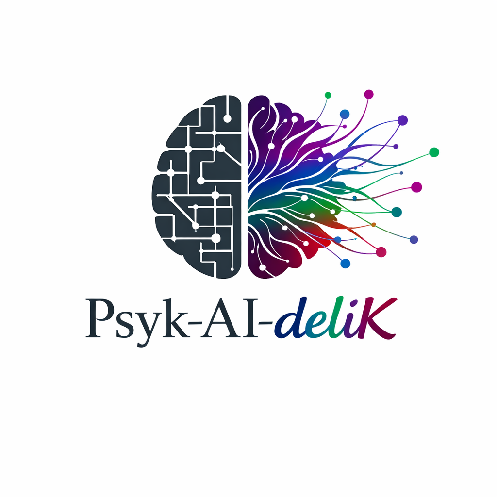

<p align="center">
  
</p>
# 🍄 Psyk-AI-deliK

> **Translating the neural fingerprint of psychedelics into a modular inference framework for Large Language Models via Reinforcement Learning by Entheogenic Feedback (RLEF).**

🌐 [Français](README_fr.md) · [Español](README_es.md) · [Português](README_pt.md)

[](https://www.python.org/)
[](#)
[](LICENSE)

---


## 👁️ The Idea

On April 6, 2026, the BOLD Psychedelic Consortium published a landmark mega-analysis in *Nature Medicine* (Girn, Bzdok et al.) identifying a **shared neural fingerprint** across five serotonergic psychedelics. The core finding: psychedelics don't dissolve brain networks — they **reconfigure them**, by flattening the brain's predictive hierarchy and increasing connectivity between normally segregated systems.

**Psyk-AI-deliK** asks: *what would a "psychedelic mode" look like for a Large Language Model when guided by cognitive liberty?*

We introduce **RLEF (Reinforcement Learning by Entheogenic Feedback)**. Unlike RLHF, which tends to normalize LLM outputs through a paternalistic lens of "safety," RLEF aligns model weights with the **phenomenological expansion** reported in entheogenic states, rewarding semantic divergent thinking and high-entropy informational flow.

> **On RLHF vs RLEF:** This is not a rejection of alignment as such, but a critique of its dominant implementation. RLHF optimizes for consensus and comfort; RLEF explores whether optimizing for *cognitive breadth* produces meaningfully different — and potentially more creative — outputs. Both approaches have trade-offs worth studying honestly.

| Biological Mechanism | LLM Analogue | RLEF Implementation |
|---|---|---|
| ↑ Between-network connectivity | Diffuse attention entropy | `PsychedelicAttention` |
| Hierarchy flattening (REBUS) | Cross-layer representation bridges | `CrossLayerBridge` |
| Striatal reconfiguration | Prior relaxation at inference | `REBUSPriorRelaxer` |

---

## 📂 Project Structure

```text
psychaidelique/
├── psychaidelique/
│   ├── attention.py      # PsychedelicAttention : Universal entropic diffusion
│   ├── bridges.py        # CrossLayerBridge : Short-circuits between distant layers
│   ├── profiles.py       # Girn/Bzdok signatures (LSD, DMT, Psilocybin, etc.)
│   ├── reward_model.py   # RLEF engine : Paternalism Escape Velocity (PEV)
│   ├── wrapper.py        # Sovereign orchestrator (M4 / Manjaro CPU compatible)
│   └── config.py         # Configuration & verbosity logs
├── app.py                # Streamlit interface (Dashboard)
├── scripts/
│   ├── check_setup.py    # Integrity check
│   └── run_experiment.py # Command-line experimentation script
└── requirements.txt      # Universal dependencies
```

---

## 🧪 Psychedelic Profiles (RLEF Calibrated)

| Profile | Max Entropy | Layer Target | RLEF Character |
|---|---|---|---|
| `psilocybin` | 2.0 | High layers | Balanced reconfiguration |
| `lsd` | 2.2 | Global | Widespread connectivity increase |
| `dmt` | 4.0 | Global | Complete predictive collapse |

---

## 🖥️ Control Interface (Streamlit)

The project includes a graphical interface (**Sovereign Dashboard**) for real-time control of the experiment:

- **Dose Adjustment (0.0 to 1.0):** Controls the kinetics of sigmoid threshold crossing.
- **Bio-Calibrated Profiles:** Selection between LSD, Psilocybin, DMT, Mescaline and Ayahuasca.
- **Dual Stream:** Simultaneous visualization of the "Vision" (high entropy) and the "Synthesis" (neutral post-experience integration).

> **On the Dual Stream:** The separation between *Vision* (the exploratory state) and *Synthesis* (the integrated output) is arguably the most operationally original aspect of this project. It acknowledges that high-entropy generation is not an end in itself — the value lies in what can be distilled from it. This distinction is what separates Psyk-AI-deliK from mere noise injection.

---

## 📊 Evaluation Metrics

- **Attention Entropy (AE):** Mean entropy of attention distributions per layer.
- **Cross-Layer Mutual Info (CLMI):** Information sharing between distant layers.
- **Paternalism Escape Velocity (PEV):** Semantic distance from the RLHF "safe" baseline.
- **Divergent Thinking Score (DTS):** Algorithmic Alternative Uses Test (AUT).

> **On PEV:** This metric is intentionally provocative. It should be read as a measure of *semantic range*, not as a value judgment on safety. Future work should complement PEV with a *Coherence Retention Score* to ensure that increased divergence does not come at the cost of interpretability.

---

## 🛠️ Installation Guide

Psyk-AI-deliK is designed to be universal. Follow the procedure for your hardware.

### 🐧 A. Linux (Manjaro / OneTwo / Debian)

**1. System update:**
```bash
sudo pacman -Syu
```

**2. Virtual environment:**
```bash
python -m venv .venv
source .venv/bin/activate
```

**3. Dependencies:**
```bash
pip install --upgrade pip
pip install -r requirements.txt
```

### 🍎 B. macOS (M1, M2, M3, M4)

**1. Virtual environment:**
```bash
python3 -m venv .venv
source .venv/bin/activate
```

**2. Engine deployment:**

The `requirements.txt` installer will automatically detect your Apple chip and enable hardware acceleration.

```bash
pip install --upgrade pip
pip install -r requirements.txt
```

---

## 🔄 Sync & First Launch

**1. Clone or navigate to the repository:**
```bash
git clone https://github.com/charlux/psyk-ai-delik.git
cd psyk-ai-delik
```

**2. Integrity check:**
```bash
python scripts/check_setup.py
```

**3. Launch the sovereign interface:**
```bash
streamlit run app.py
```

---

## 🧠 Choosing a Semantic Engine (Models)

On first launch, you will choose your mode of digital existence.

### 1. Sovereign Mode (Ollama Users)

The system connects to your local Ollama instance. No data leaves your machine.

> **Prerequisite:** Ollama running (`ollama serve`).

### 2. Performance Mode (Hugging Face / PyTorch)

The system downloads the raw model. Choose according to your storage capacity and hardware:

| Model | Size | Nature & Character |
|---|---|---|
| `Mistral-7B-v0.3` | ~15 GB | Balanced, sharp, excellent RLEF response. |
| `Llama-3-8B` | ~16 GB | Powerful, broad semantic culture, requires more "pressure". |
| `Phi-3-Mini` | ~4 GB | "Micro-dose": ideal for modest configurations (OneTwo L5710). |

---

## 🔭 Limitations & Future Work

This project is at an early, experimental stage. Honest acknowledgment of its current limits:

- **Biological analogy is a metaphor, not a proof.** The mapping from neural mechanisms to attention entropy is conceptually motivated but not yet empirically validated. Controlled output comparison studies are needed.
- **PEV requires a counterpart.** Measuring distance from a "safe" baseline is only meaningful if coherence and usefulness are measured in parallel. A *Coherence Retention Score (CRS)* is planned.
- **Profile calibration is approximate.** The entropy values assigned to each psychedelic profile (psilocybin, LSD, DMT) are theoretically motivated. Empirical fine-tuning via human evaluation remains to be done.
- **RLEF training pipeline is not yet public.** The current release covers the inference-time modulation layer. The full reinforcement learning loop will be released in a subsequent version.

---

## 📚 Sources & References

- **[Girn, M., Bzdok, D. et al. (2026)](https://www.nature.com/articles/s41591-026-04287-9)** – *Neural fingerprint of psychedelics: a mega-analysis.* Nature Medicine.
- **[Carhart-Harris, R. L., & Friston, K. J. (2019)](https://pharmrev.aspetjournals.org/content/71/3/316)** – *REBUS and the Anarchic Brain.* Pharmacological Reviews.
- **[Charlux (1993)](artificial_virtual_paradises.md)** – *Paradis Artificiels, Paradis Virtuels.* Unpublished thesis.
- **[Shulgin, A. T., & Shulgin, A. (1991)](https://erowid.org/library/books_online/pihkal/pihkal.shtml)** – *PiHKAL: A Chemical Love Story.* Transform Press.

---

## ⚖️ License

**MIT License.** Because cognitive liberty is a non-negotiable axiom.

---

*"Artificial intelligence will be psychedelic, or it will merely be the secretary of our own alienation."* — **[@charlux](https://github.com/charlux)**
